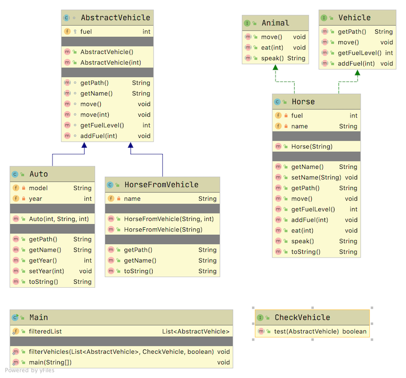

# Java Transportation

## Introduction

This project is used to introduce in Java

* Interfaces
* Abstract Classes
* Lambda Expressions

## Layout

The main class with the main method contains most of the work. The work is meant to highlight what can be done with interfaces, abstract classes and lambda expressions.



## Results

The output of this application is:

```TEXT
*** Working with Interfaces ***
Seabiscuit 7


*** From Abstract Class ***
Secretariat 30
Eclipse -9

*** This List ***
[HorseFromVehicle{name='Secretariat', fuel=30}, HorseFromVehicle{name='Trigger', fuel=20}, HorseFromVehicle{name='Seattle Slew', fuel=20}, HorseFromVehicle{name='American Pharoah', fuel=20}, HorseFromVehicle{name='Eclipse', fuel=-9}, Auto{year=2000, fuel=-5}, Auto{year=1998, fuel=10}, Auto{year=2003, fuel=5}]


*** Working with Lambda Expressions ***

*** This List Sorted ***
Accord
American Pharoah
Eclipse
EuroVan
Seattle Slew
Secretariat
Trigger
Tundra

*** This List Negative Fuel ***
Eclipse -9
EuroVan -5

*** Horse with positive Fuel Sorted by Name ***
HorseFromVehicle{name='American Pharoah', fuel=20}
HorseFromVehicle{name='Seattle Slew', fuel=20}
HorseFromVehicle{name='Secretariat', fuel=30}
HorseFromVehicle{name='Trigger', fuel=20}
```

Do note that while an Egyptian pharaoh is spelled with a *aoh*, the horse American Pharoah is spelled with a *oah*.
